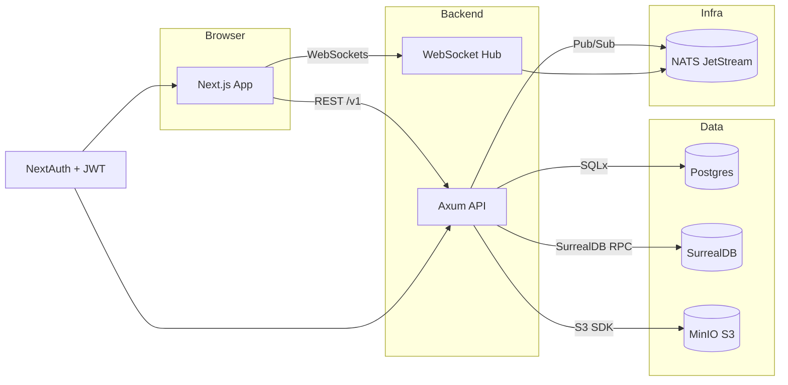

# Architecture Overview

The Love of Food platform combines a Rust-centric backend with a React/Next.js frontend. This document explains the runtime topology, key flows, and integration points so operators can reason about deployments and contributors can extend the system safely.

## High-level Diagram

## Request Flow

1. The browser loads the Next.js marketing or app routes. Authentication is handled via NextAuth.js using Google, GitHub, Apple, or Email magic link.
2. Once authenticated, the web app stores a secure JWT (RS256) issued by NextAuth. The token is attached to API requests via the `Authorization: Bearer` header.
3. The Rust Axum API validates JWTs against the NextAuth-hosted JWKS endpoint, caches keys, and enriches the request context with the user identity.
4. Business operations use Postgres for transactional data (recipes, shopping lists) and SurrealDB for social graph edges (liked, cooked, follows, etc.). Writes are wrapped in structured logging via `tracing`.
5. Events (e.g., recipe created, shopping list updated) are published to NATS for real-time fan-out. The WebSocket hub subscribes to relevant subjects and forwards updates to clients.
6. File uploads are presigned by the API and stored in MinIO. A background job (future work) will handle thumbnail generation.

## Rust Service Composition

* `main.rs` wires Axum routes, middleware (JWT validation, rate limiting, secure headers), and dependency injection of repositories.
* Each feature (recipes, shopping lists, feed) has a dedicated handler module under `src/handlers/` and request validation structs in `src/models/`.
* Storage abstraction layers in `src/storage/` encapsulate SQLx queries and SurrealDB operations.
* WebSocket logic under `src/ws/` manages connection state and subscribes to NATS subjects.

## Next.js Application Structure

* Marketing routes live in `app/(marketing)`; authenticated app routes live in `app/(app)`.
* API routes under `app/api` proxy auth callbacks, JWKS exposure, and S3 thumbnail tasks.
* Shared UI components reside in `components/` with heavy comments for accessibility.
* Client data fetching uses TanStack Query for caching and optimistic updates.

## Deployment

* Development uses Docker Compose (`infra/docker/docker-compose.yml`) to run Postgres, SurrealDB, MinIO, and NATS.
* Production is designed for Fly.io or any container orchestrator. Configuration lives under `infra/fly/fly.toml.example`.
* GitHub Actions build/test pipeline ensures code quality before merge. Docker images can be built and pushed in CI once registries are configured.

For deeper dives into schemas and flows, see `docs/data-models.md` and `docs/governance.md`.
